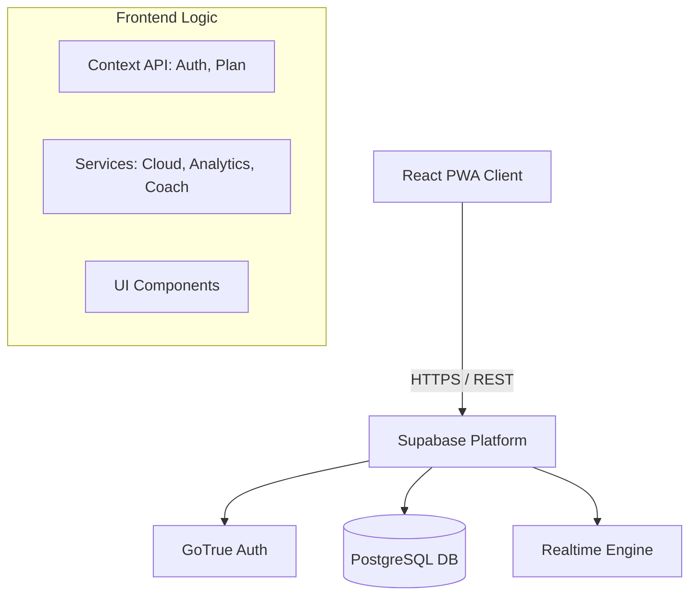

# Architettura del Sistema - SalesOS

Questo documento descrive l'architettura tecnica di SalesOS, le scelte progettuali e il modello dei dati.

## 1. Panoramica Architetturale

Il sistema segue un'architettura **Serverless** basata su **React (SPA)** per il frontend e **Supabase** per il backend (Database, Auth, API, Edge Functions).

### Diagramma Concettuale

## 2. Frontend Structure

Il codice è organizzato modularmente per separare la logica di business dalla UI.

*   **/components**: Componenti React riutilizzabili e viste principali (Dashboard, EntryForm, TeamView, etc.).
*   **/services**: Logica pura TypeScript.
    *   `auth.tsx`: Gestione sessione e profilo utente.
    *   `cloud.ts`: Layer di astrazione per le chiamate al DB (CRUD).
    *   `analytics.ts`: Motore di calcolo KPI e logica AI (generazione diagnosi testuale).
    *   `planning.ts`: Motore matematico per il calcolo previsionale (Reverse Funnel).
    *   `coach.ts`: Logica di aggregazione dati per le viste team.
*   **/types**: Definizioni TypeScript condivise (Single Source of Truth per i modelli dati).

## 3. Data Model (Database Schema)

Il database PostgreSQL è strutturato attorno a 4 entità principali.

### A. Profiles (`public.profiles`)
Estensione della tabella `auth.users` di Supabase.
*   `user_id` (PK, FK auth.users)
*   `role`: 'admin', 'leader', 'collaboratore'
*   `team_id`: Identificativo del team di appartenenza.
*   `leader_id`: Riferimento gerarchico diretto.
*   `status`: 'active', 'inactive'.

### B. Daily Logs (`public.daily_logs`)
Cuore del sistema. Un record per utente per giorno.
*   `user_id`, `date` (Composite Unique Key)
*   Metriche Funnel: Outreach (Calls, Msg), Booked, Done, Won (per prodotto LA, FV, CAD).
*   Metriche Mentali: Energy, Focus, Confidence (1-10).
*   Snapshot Target: Salva i target giornalieri al momento dell'inserimento per storicizzare la compliance.

### C. Monthly Plans (`public.monthly_plans`)
Obiettivi mensili definiti dagli utenti.
*   `user_id`, `month` (YYYY-MM)
*   `target_won_*`: Obiettivi di vendita per prodotto.
*   `workdays_per_week`: Configurazione lavorativa.

### D. Invites (`public.invites`)
Sistema di inviti sicuro per la registrazione.
*   `code`: Codice univoco.
*   `role_assigned`: Ruolo che l'utente assumerà.
*   `leader_id_assigned`: Assegnazione automatica della gerarchia alla registrazione.

## 4. Security & Permissions (RLS)

La sicurezza è gestita a livello di database tramite **Row Level Security (RLS)**.

*   **Admin**: Accesso completo (`true` policy) a tutte le tabelle.
*   **Leader/Coach**: 
    *   SELECT sui profili e log della propria downline (definiti tramite `leader_id`).
    *   Non possono modificare dati altrui.
*   **Collaboratore**:
    *   CRUD solo sui propri record (`auth.uid() = user_id`).
    *   Non ha accesso in lettura ai dati di altri utenti (tranne il proprio profilo).

## 5. Logiche Chiave

### Reverse Funnel Engineering (`planning.ts`)
Il sistema non chiede "Quante chiamate vuoi fare?", ma "Quanto vuoi guadagnare (Vinti)?".
Basandosi sui tassi di conversione storici dell'utente (Win Rate, Show Rate, Booking Rate), calcola a ritroso il volume di attività necessario (Chiamate) per raggiungere l'obiettivo matematicamente.

### AI Coach Logic (`analytics.ts`)
Un sistema esperto basato su regole (Rule-Based AI) analizza i KPI giornalieri/settimanali e genera:
1.  **Diagnosi**: Identifica il collo di bottiglia (Volume, Booking, Show, Closing).
2.  **Action Plan**: Suggerisce 3 azioni correttive specifiche.
3.  **Priority**: Definisce il focus immediato.
